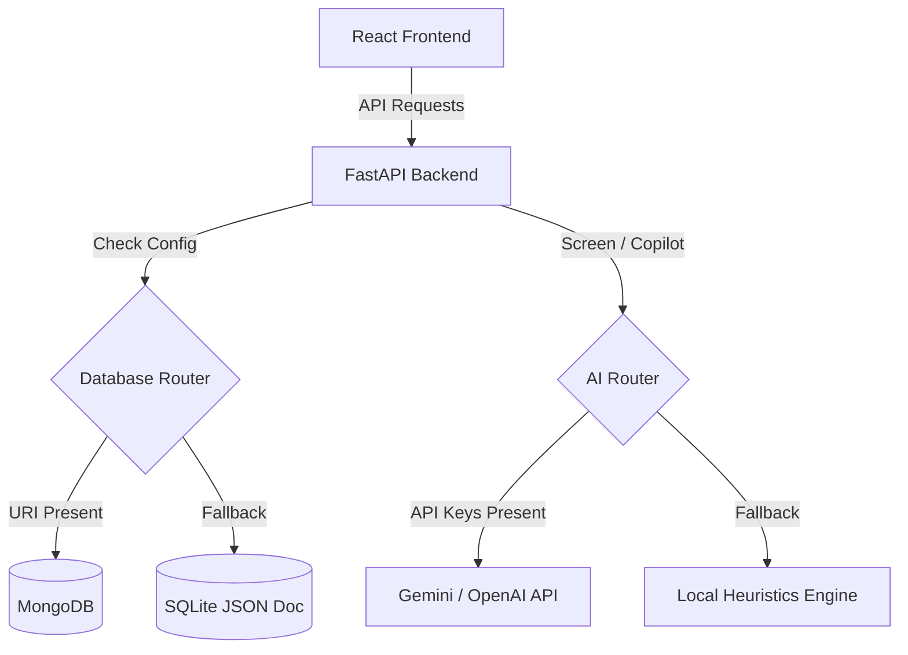

# TalentAI HRMS: AI-Powered HR Management Platform

TalentAI HRMS is a production-ready, commercial-grade Human Resource Management System (HRMS) built to automate candidate sourcing, resume screening, structured technical interviews, pre-joining onboarding, and HR analytics.

---

## Key Features

1. **AI Resume Screening (ATS Match 0-100)**: Single/bulk resume processing. Automatically parses skills, education, and years of experience, evaluating skill gaps and recommendations (Shortlist/Reject) against active job specifications.
2. **AI Interview Simulator**: Dynamically constructs technical/behavioral question lists. Features a simulated speech-to-text response interface, evaluating communication clarity, confidence metrics, and response sentiments.
3. **AI Analytics Dashboard**: Visualizations of recruitment pipelines, hiring trends, department splits, and candidate success predictions.
4. **AI Recruitment Copilot**: An interactive chatbot panel processing natural language queries (e.g., *"Show top candidates for Data Analyst"*, *"Who has the highest ATS score?"*, *"Generate questions for Python Developer"*).
5. **Role-Based Portals**: Guarded layouts supporting Super Admin, HR Manager, Recruiter, Interviewer, and Candidates.
6. **Robust Resiliency Engine**: Dual-mode data/AI fallback. Connects to live MongoDB and LLM API keys if provided; otherwise, falls back to local SQLite JSON databases and highly realistic heuristic models to guarantee a 100% working sandbox.

---

## Tech Stack

- **Frontend**: React.js (Vite) + Tailwind CSS + Lucide Icons
- **Backend**: FastAPI (Python 3.10) + Uvicorn
- **Database**: MongoDB (Local/Docker) or SQLite (Local file fallback)
- **Deployment**: Docker, Docker Compose

---

## Quick Sandbox Demo Logins

Use the password `password123` for all demo accounts:

| Role | Email | Purpose |
|---|---|---|
| **HR Manager** | `hr@talentai.com` | Access dashboards, create jobs, trigger screening, view copilot |
| **Recruiter** | `recruiter@talentai.com` | Upload resumes, compare candidates, view pipeline boards |
| **Interviewer** | `interviewer@talentai.com` | View candidate profiles, verify technical answer reports |
| **Candidate** | `candidate@talentai.com` | Complete structured interview simulators, upload onboarding documents |

---

## Getting Started: Local Sandbox Run

### Prerequisites
- Python 3.10+
- Node.js 18+

### 1. Run the Backend API
1. Navigate to the backend directory:
   ```bash
   cd backend
   ```
2. Install dependencies:
   ```bash
   pip install -r requirements.txt
   ```
3. Start the API server:
   ```bash
   uvicorn app.main:app --reload
   ```
   *The Swagger interactive documentation will be available at `http://localhost:8000/docs`.*

### 2. Run the Frontend Dashboard
1. Navigate to the frontend directory:
   ```bash
   cd frontend
   ```
2. Install npm packages:
   ```bash
   npm install
   ```
3. Start the development server:
   ```bash
   npm run dev
   ```
   *Open `http://localhost:5173` in your browser to launch the landing page.*

---

## Deployment: Docker Compose Run

To deploy the entire production stack (MongoDB database, FastAPI backend, and Nginx React server) in single command:

1. In the root directory, run:
   ```bash
   docker-compose up --build
   ```
2. Open `http://localhost` (or port mapped) to view the application.

---

## Architecture Design


